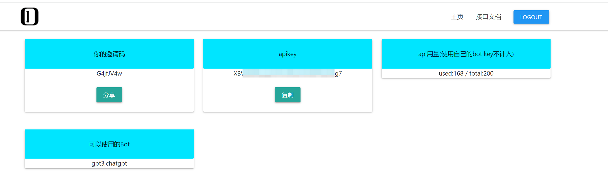
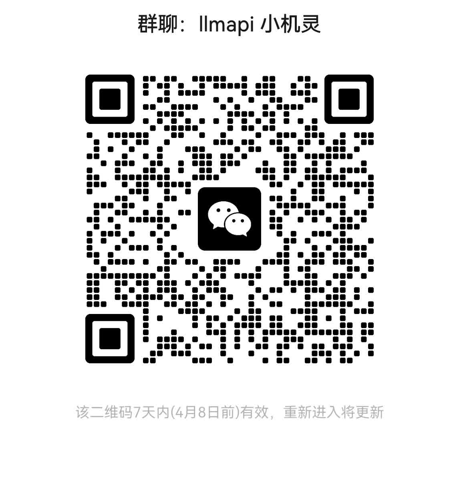

# Siri-小机灵

通过苹果的**捷径**连接LLMAPI，接入ChatGPT(微软NewBing、文心一言等后续支持)，让你瞬间拥有一个人工智能小伙伴。你可以直接输入问题或者通过Siri和TA对话，体验最新的人工智能技术。
而这一切，都无需下载APP、无需魔法，无需接码平台，无需繁琐的付费流程，即可体验。

# 使用方法

## 获取llmapi apikey
- 打开网址https://llmapi.io

- 点击右上角注册按钮
- 输入邮箱、密码、邀请码(使用邀请码G4jfJV4w注册账号，共同获得100次对话次数)
- 点击获取验证码
- 在你邮箱的收件箱里找到验证码并填入
- 注册成功后登录网站,进入**控制台**
- 复制apikey

## 下载小机灵
### 如果你曾经下载过我们的捷径,建议先将旧版本捷径删除

### 小机灵1.0
- 初始版本,仅单轮对话
- 下载地址:https://www.icloud.com/shortcuts/5649770cb94a4ca2b54d7eb1885aad9e
- 也可以扫码下载

## 配置小机灵
打开**快捷指令** APP，找到刚刚下载的**小机灵**，长按选择**编辑**，将第一步的apikey复制到这个文本框里(注意是整个文本框里只有apikey,需要将原本的内容删掉)
<table><tr>
<td></td>
<td></td>
<td></td>
</tr></table>

## 使用
- (可选,推荐)将刚刚下载的捷径添加到桌面
<table><tr>
<td></td>
<td></td>
</tr></table>

- 在桌面或快捷指令里面点击**小机灵**,即可开始聊天
<table><tr>
<td></td>
<td></td>
</tr></table>
<table><tr>
<td></td>
<td></td>
</tr></table>
<table><tr>
<td></td>
<td></td>
</tr></table>

- 也可以通过对着Siri说**小机灵**,回复**我是小机灵,请说**即可
<table><tr>
<td></td>
<td></td>
</tr></table>

# 微信交流群

